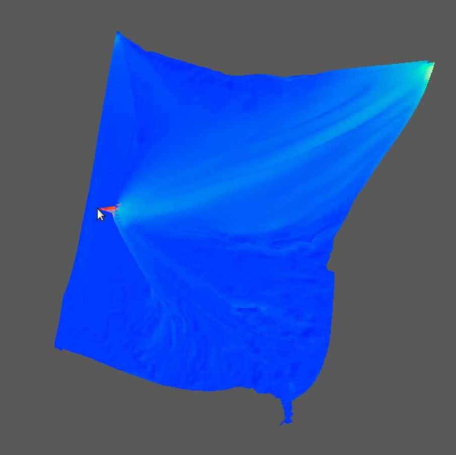
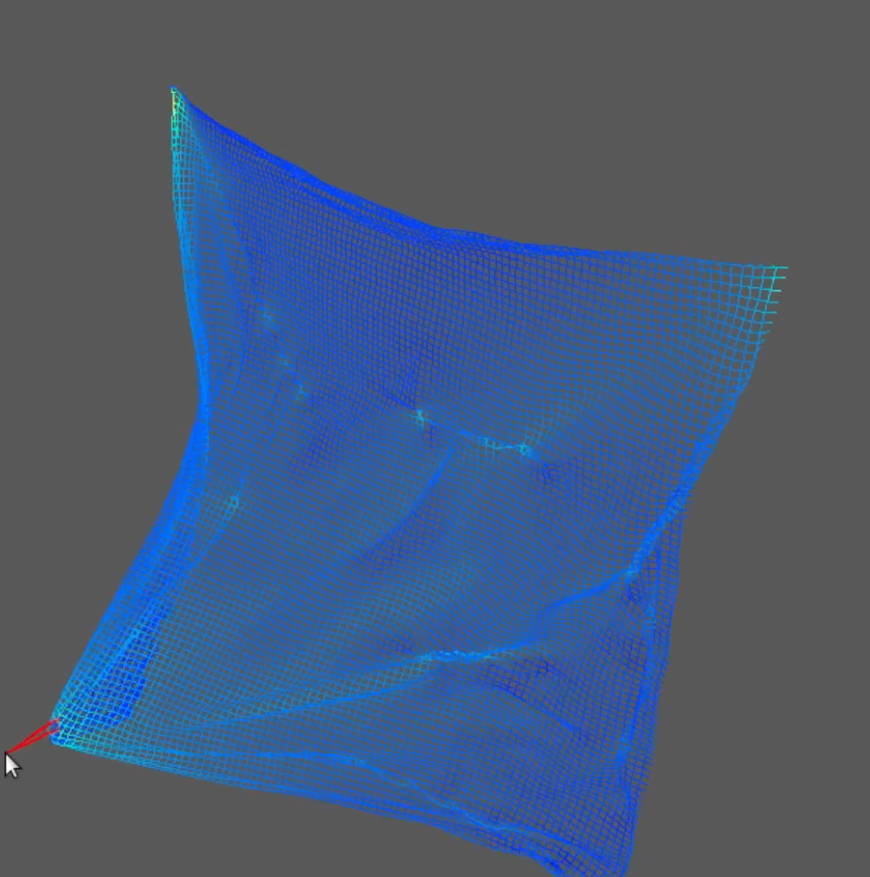

# Position-based Dynamics

Position-based Dynamics using WebGPU and C11





## Building

Prerequisites:
- cmake
- make
- C compiler (that supports C11)
- docker (if you are building for web)

Note: WebGPU is still experimental and may not work on all browsers and platforms.

```bash
make desktop # For desktop

# Assets need to be relative of the executable (./assets/...)

make web # For html5
```

You may need to install some additional libraries (cmake will notify you).